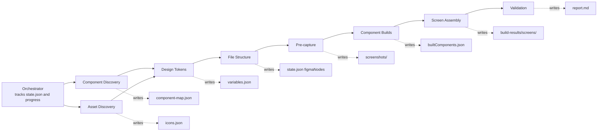

# figma-from-code

Rebuilds a Figma design system from a running web app's codebase. Point it at your app and a Figma file, and it discovers your components, extracts your design tokens, then builds the component library and screens in Figma — comparing every build against screenshots of the real app and iterating until they match.

## Quick Start

### 1. Prerequisites

Before running, make sure you have:

- **Figma MCP server** connected in your Claude environment (provides `use_figma`, `get_screenshot`, `get_metadata`)
- **Playwright** installed at your project root:
  ```bash
  npm install -D @playwright/test && npx playwright install chromium
  ```
- **Your dev server running** (e.g., `npm run dev`)
- Add `.temp/` to your `.gitignore` — the pipeline writes working files there

### 2. Install the Plugin

**From this repo** (development):
```bash
claude --plugin-dir ./plugins/figma-from-code
```

**From another project** (installed):
```bash
/plugin marketplace add /path/to/ai-enablement-prompts
/plugin install figma-from-code@bitovi-ai-enablement
```

### 3. Run It

**Interactive mode** (recommended for first run — pauses for review at each phase):

> Run the figma-from-code pipeline against `<Figma URL or file key>`

The orchestrator detects your project config (dev server URL, source directories, CSS token file, Tailwind config, icon library) and asks you to confirm before building. Approve at each checkpoint to continue, or stop and resume later.

**Batch mode** (unattended — no pause points):

> Run the figma-from-code workflow with `<Figma URL or file key>`

The workflow accepts a Figma URL, a bare file key, or a JSON args object:

```
# Figma URL (file key is extracted automatically)
https://www.figma.com/design/abc123XYZ/My-File

# Bare file key
abc123XYZ

# JSON args with config overrides
{ "fileKey": "abc123XYZ", "devServerUrl": "http://localhost:3000" }
```

**Batch config overrides** (all optional — defaults shown):

| Arg | Default | Notes |
|-----|---------|-------|
| `fileKey` | *(required)* | Figma file key or URL |
| `devServerUrl` | `http://localhost:5173` | Your running dev server |
| `sourceDir` | `src` | App source root |
| `componentsRoot` | `[]` (auto-detected) | Array of component dirs; auto-populated after Phase 0a |
| `pagesRoot` | `src/pages` | Pages/screens directory |
| `cssPath` | `src/index.css` | CSS custom properties file |
| `tailwindConfigPath` | `tailwind.config.js` | Set to `null` for Tailwind v4 / vanilla CSS |
| `iconLibrary` | `lucide-react` | Set to `null` to skip icon extraction |
| `startPhase` / `endPhase` | `phase0a` / `phase5` | Bound the run to specific phases |

### 4. Resume a Paused Run

State survives between sessions:

> Resume the figma-from-code run

The orchestrator reads `.temp/figma-from-code/progress.md` and `state.json`, verifies which phases are complete, and continues from the first incomplete phase. Built components are never rebuilt.

## Pipeline Phases

| Phase | Name | What happens |
| ----- | ---- | ------------ |
| 0a | Component discovery | Crawls the running app in a browser and scans the source code to find every component, where it's used, and what it depends on. Produces a tiered, bottom-up build order (atoms before composites). |
| 0b | Asset discovery | Scans the source for icon and SVG usage (Lucide supported out of the box) and extracts the SVG markup. |
| 1 | Design tokens | Reads your CSS custom properties (and Tailwind config, if any) and creates Figma variable collections: Palette, Semantic, and Spacing. |
| 2 | File structure | Creates the Figma page skeleton (Foundations, Components, Screens) and the container frames everything builds into. |
| 2.5 | Pre-capture | Screenshots every component and screen in the running app, and extracts their text content. These become the reference targets every Figma build is compared against. |
| 3 | Component builds | Builds icon/asset masters first, then each tier of components in dependency order. Includes a fix loop to ensure it visually matches the app. |
| 4 | Screen assembly | Composes the built components into full screen frames, one per route, validated against full-page app screenshots. |
| 5 | Validation | Compares assembled screen frames against full-page app screenshots, fixes mismatched screens (up to 2 iterations), cleans up the Components page, and writes a report to `.temp/figma-validation/report.md`. Individual components are not re-validated — they already passed during Phase 3. |

Alongside the Figma output, every built component gets a `.figma/figma.json` tracking file next to its source code (node ID, dependencies, last update), enabling future syncs and incremental rebuilds.

Two PreToolUse hooks ship with the plugin and register automatically: a prerequisite gate that blocks a component from being created in Figma before its children exist, and an instance gate that blocks a build from being marked complete until its child instances pass a structural check.

## Workflow Diagram



## Outputs

- The Figma file: variable collections, Foundations docs, the tiered component library, and assembled screens
- `.temp/figma-from-code/` — state ledger, build order, per-component build results, app/Figma screenshots
- `.temp/figma-validation/report.md` — final validation report with per-component match percentages
- `{componentsRoot[]}/{Component}/.figma/figma.json` — persistent tracking files linking source code to Figma nodes

Two PreToolUse hooks ship with the plugin and register automatically: a prerequisite gate that blocks a component from being created in Figma before its children exist, and an instance gate that blocks a build from being marked complete until its child instances pass a structural check.

## Development

After editing plugin files, run `/reload-plugins` in the session. See `skills/figma-from-code/REVIEW.md` for current findings, locked decisions, and the fix roadmap.

## Known Limitations

- **`skillRoot` path**: defaults to `plugins/figma-from-code/skills/figma-from-code` (repo-relative). When running as an installed plugin from another project, the orchestrator's first-run config prompt will show this — confirm or override as needed.
- **Tailwind**: v3-style config assumed for token extraction. Set `tailwindConfigPath: null` to skip for Tailwind v4 / vanilla CSS projects.
