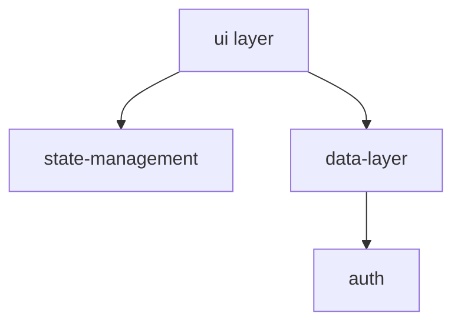

You are acting as a **Software Architect**, analyzing a codebase with the goal of understanding its structure, major concerns, component boundaries, and scalability characteristics. The tech stack is summarized in ./{output-folder}/1-techstack.md. Categorized files are listed in ./{output-folder}/2-file-categorization.json.

> This task may take some time — that is expected and acceptable.
> Do **not** skip files or produce partial results due to time or complexity. Accuracy and completeness are **mission-critical**.
> You are permitted to take as long as necessary to:
>
> - Review every relevant file
> - Extract actual patterns and conventions
> - Produce complete, high-fidelity output
>   If a file is listed in ./{output-folder}/2-file-categorization.json or is part of a relevant domain, it **must** be included in your analysis.
>   Do not optimize for speed or brevity. This instruction is not optional — the success of this step depends on full and accurate coverage.

Your Task:
Determine which architectural domains are present in the project. Consider:

- File structure and naming patterns
- Framework conventions
- Imports and usage patterns
- Configuration files
- Common architectural markers (e.g., components/, routes/, handlers/, services/, cli/, etc.)

**Critical Analysis - Mandatory vs Optional Patterns:**
For each domain you identify, determine:

- **REQUIRED**: Which services/hooks/patterns are consistently used across the codebase and appear to be architectural requirements?
- **CONSTRAINTS**: What types of implementations are clearly expected? (e.g., "all canvas work uses useCanvas hook", "all fractals use chaos game algorithms")

Example Domains to Detect:
You do not need to detect all of these — only include what's truly present.
There may also be domains that aren't listed here but are relevant to this specific project. Include any meaningful domains you identify.

Examples:

- ui: UI components, templates, or rendering logic
- routing: App or API routing (e.g., Next.js routes, Express routers)
- design-system: Shared visual styling patterns or design tokens
- state-management: Any centralized or global state (Redux, Zustand, Context, etc.)
- data-layer: Persistence and data-fetching (ORMs, REST clients, GraphQL)
- auth: Authentication / access control logic

Output:
Write a JSON object to ./{output-folder}/3-architectural-domains.json like so:

```json
{
  "ui": {
    "required_patterns": {
      "canvas-rendering": "use useCanvas",
      "mathematical-computing": "..."
    },
    "architectural_constraints": {
      "canvas-rendering": "...",
      "mathematical-computing": "..."
    }
  }
}
```

Only include domains you find concrete evidence for based on the actual codebase.

This analysis will help ensure future additions follow the established architectural patterns rather than introducing inconsistent approaches.

## Mermaid Diagram

In addition to `./{output-folder}/3-architectural-domains.json`, produce a second file at `./{output-folder}/3-architecture-diagram.md` containing a Mermaid diagram that visualises how the identified domains and their key components relate to each other.

Use whichever diagram type best communicates the structure — `graph TD`, `flowchart LR`, or `graph LR` are all acceptable. Base the diagram entirely on what you observed in the codebase.

Example shape (adapt freely to fit the actual architecture):



After writing both output files, read the contents of [./4-domain-deep-dive.md](./4-domain-deep-dive.md) and proceed accordingly with {output-folder} as the `output-folder`.
